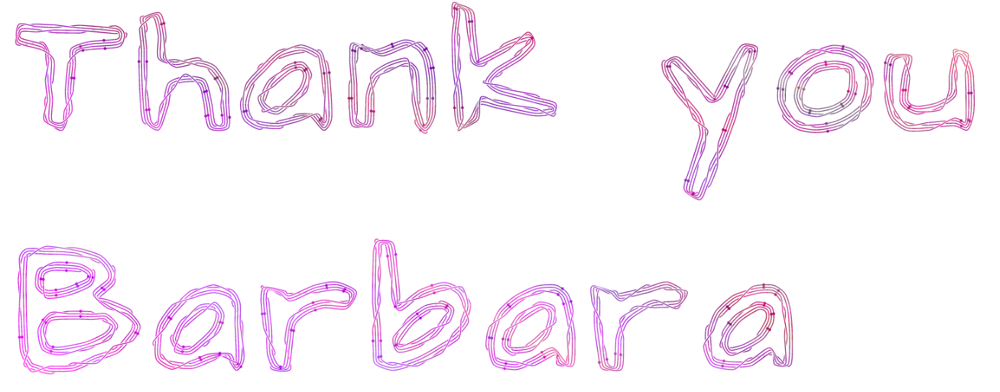

# decoration

<https://quonpicturelanguage.github.io/decoration/playground.html>

Picture to Quon strings.

output demo:

This project is made for the retirement of Barbara Drauschke, thanks for your assistance with the Mathematical Picture Language Project.

## License

GPLv2 (but you can use the images generated by this project as you wish.)

## third party library

bezierjs from <https://github.com/Pomax/bezierjs> MIT License

potrace from <https://github.com/kilobtye/potrace> GPLv2 License

font 'Architects Daughter' from <https://fonts.google.com/specimen/Architects+Daughter> SIL OPEN FONT LICENSE Version 1.1
